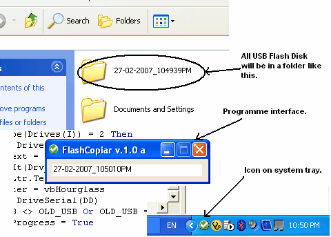



## USB Flash Disk Copiar

### Description

Thank you for downloading my software from The Planet Source Code website. I hope my software to be helpful to you to get some ideas or to develop it to another software. This code is used to copy all the USB flash disk to a folder on your hard drive which is stated the date and the time of coping process at it's name. It's do the same with all flash disk connected with PC. I used some ideas from codes on planet source code. Many thanks to thos people who I take the code from them.

Please if you like it ... vote it !
 
### More Info
 

             |
---                |---
**Submitted On**   |2007-02-08 23:29:18
**By**             |[Ahmad Eissa](https://github.com/Planet-Source-Code/PSCIndex/blob/master/ByAuthor/ahmad-eissa.md)
**Level**          |Intermediate
**User Rating**    |5.0 (25 globes from 5 users)
**Compatibility**  |VB 5\.0, VB 6\.0
**Category**       |[Files/ File Controls/ Input/ Output](https://github.com/Planet-Source-Code/PSCIndex/blob/master/ByCategory/files-file-controls-input-output__1-3.md)
**World**          |[Visual Basic](https://github.com/Planet-Source-Code/PSCIndex/blob/master/ByWorld/visual-basic.md)
**Archive File**   |[USB\_Flash\_2050602272007\.zip](https://github.com/Planet-Source-Code/ahmad-eissa-usb-flash-disk-copiar__1-68005/archive/master.zip)

